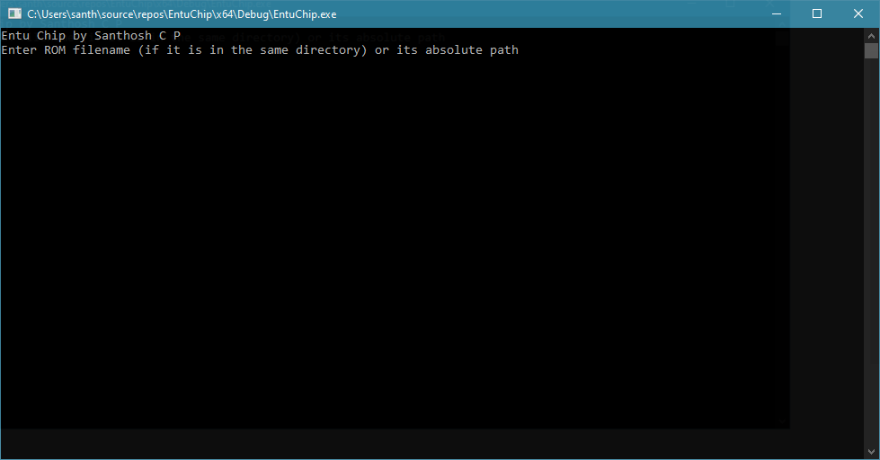
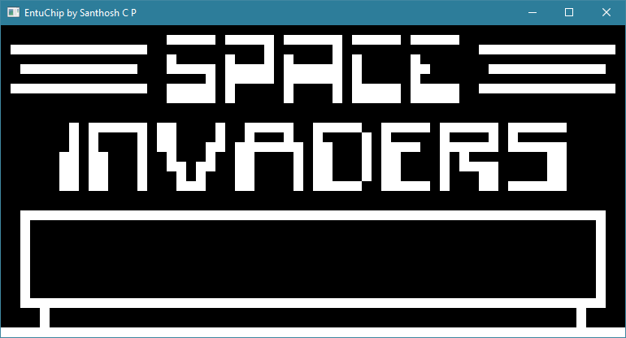

# Entuchip

'Entuchip' is my take on writing an emulator for the Chip-8. 

Entuchip is written in C++ and uses the FreeGLUT library for displaying the graphics

The name '<b>Entuchip</b>' is a combination of '<b>entu</b>' (Kannada Language pronounciation for the number Eight) and '<b>chip</b>' (from Chip-8).

# Screenshots

  

Launch screen of EntuChip

  

Running 'Invaders'

# Credits

  
<b><a href="http://freeglut.sourceforge.net/">The FreeGLUT Project</a></b>

  
This project makes extensive use of the FreeGLUT library

  
<b><a href="https://www.transmissionzero.co.uk/software/freeglut-devel/">Martin Payne's Windows binaries (MSVC)</a></b>

  
This project uses the compiled Windows binaries of the FreeGLUT Library. These binaries are included in the Dependencies folder of the project

<b><a href="http://www.multigesture.net/articles/how-to-write-an-emulator-chip-8-interpreter/">How to write an emulator (CHIP-8 Interpreter)</a></b>

This article helped me get started with writing this emulator. It provided a comprehensive introduction to Chip-8

  
<b><a href="http://devernay.free.fr/hacks/chip8/C8TECH10.HTM">Cowgod's Chip-8 Technical Reference v1.0</a></b>

  
This technical reference helped me to understand and correctly implement the features of Chip-8

